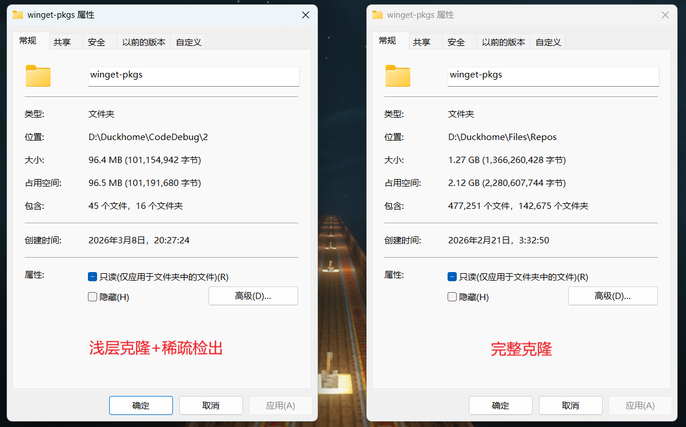

# 稀疏检出

> 官方文档: https://git-scm.com/docs/git-sparse-checkout
> GitHub Blog: https://github.blog/open-source/git/bring-your-monorepo-down-to-size-with-sparse-checkout/
> 有关部分克隆: https://git-scm.com/docs/partial-clone

稀疏检出在面对大仓库时是一个非常实用的功能，它可以让你在不克隆整个仓库的情况下修改文件。

举个简单的例子，[microsoft/winget-pkgs](https://github.com/microsoft/winget-pkgs) 就是一个非常大的仓库，但我只需要修改其下的 `manifests/d/DuckStudio/Sundry/`，我就可以这样做:

```bash
git clone --filter "blob:none" --depth 1 --sparse "https://github.com/microsoft/winget-pkgs.git" # 不要下载内容、浅层克隆、稀疏检出
cd winget-pkgs
git sparse-checkout set "manifests/d/DuckStudio/Sundry/" # 这一步需要联网
```



## 退出稀疏检出
```bash
git sparse-checkout disable # 禁用稀疏检出
git restroe . # 还原文件
```

## 添加稀疏检出的路径
```bash
# 先 git sparse-checkout set
git sparse-checkout add "<path>"
```

## 需要注意的点
1. 在 _完整克隆_ 的仓库中稀疏检出**不会**减少仓库大小。
2. 克隆时不加 `--filter blob:none` 会下载整个仓库；加了的话后面 `git sparse-checkout set` 要联网下载检出的文件
3. 克隆时可以搭配浅层克隆（`--depth 1`，仅克隆最新的 1 个提交）进一步减少下载量。
4. 稀疏检出**不是**只检出指定路径最深处的目录中的文件，而是路径上每一个目录中的文件（包括根目录）。
