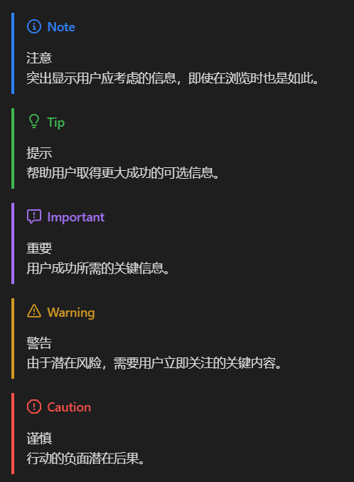

# 在GitHub突出显示部分内容

> [!TIP]
> 相关文章：[GitHub社区 #16925 [[Markdown] An option to highlight a "Note" and "Warning" using blockquote (Beta)]](https://github.com/orgs/community/discussions/16925)  

## 可用类型
```markdown
> [!NOTE]  
> 突出显示用户应考虑的信息，即使在浏览时也是如此。

> [!TIP]
> 帮助用户取得更大成功的可选信息。

> [!IMPORTANT]  
> 用户成功所需的关键信息。

> [!WARNING]  
> 由于潜在风险，需要用户立即关注的关键内容。

> [!CAUTION]
> 行动的负面潜在后果。
```

## 显示效果
> [!NOTE]  
> 注意  
> 突出显示用户应考虑的信息，即使在浏览时也是如此。

> [!TIP]
> 提示  
> 帮助用户取得更大成功的可选信息。

> [!IMPORTANT]  
> 重要  
> 用户成功所需的关键信息。

> [!WARNING]  
> 警告  
> 由于潜在风险，需要用户立即关注的关键内容。

> [!CAUTION]
> 谨慎  
> 行动的负面潜在后果。

---

> [!TIP]
> 你可以直接在GitHub仓库对应本文的页面看到效果，也可以通过下面这张图片看到效果。  
> docsify并不支持这种突出显示方式  

---


