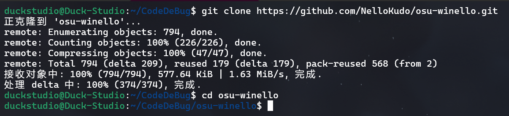
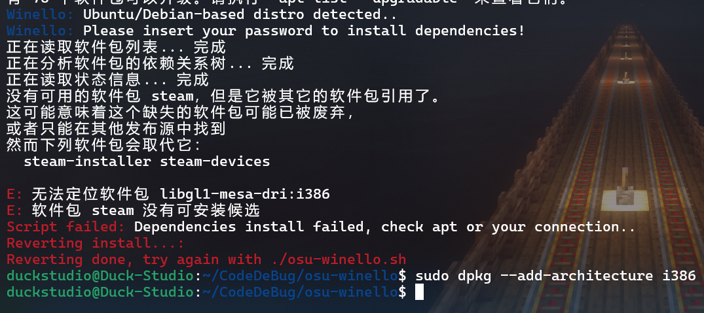
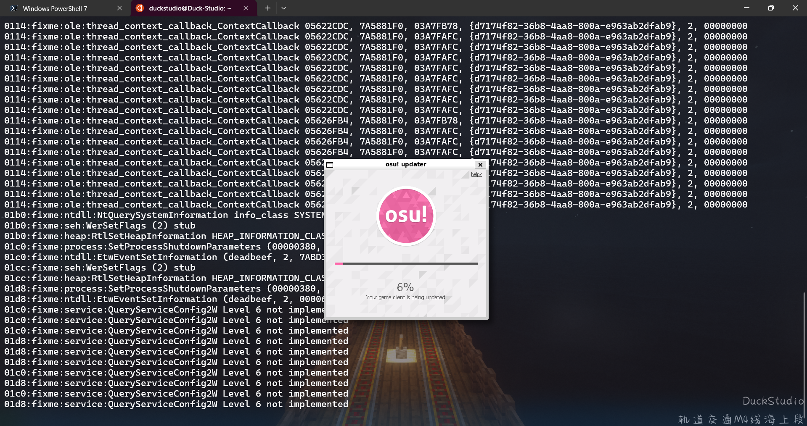

# 在 WSL Ubuntu 上安装 OSU!

> 参考帖子: https://osu.ppy.sh/community/forums/topics/1248084

## 0. 操作前确认
请确认你已安装 Ubuntu:  
```powershell
[Powered by 虚空终端] PS D:\...> wsl --list --verbose
  NAME              STATE           VERSION
* docker-desktop    Stopped         2
  Ubuntu            Stopped         2
```

## 1. 打开 Ubuntu
通过 Windows 终端配置文件或以下命令打开 Ubuntu:  
```powershell
wsl -d Ubuntu
```

## 2. 克隆 NelloKudo/osu-winello
```bash
git clone https://github.com/NelloKudo/osu-winello.git
cd osu-winello
```



## 3. 运行 osu-winello.sh
```bash
chmod +x osu-winello.sh # 给权限
./osu-winello.sh
```
在中途不建议`^C`，因为你可能在退出后会遇到“已安装，请先卸载再安装”之类的错误，对此我目前没有解决方案。  
如果遇到其他错误，请看看这里有没有相关信息:  
- [`Please install zenity before continuing!`](#31-安装-zenity)
- [`Please install unzip before continuing!`](#32-安装-unzip)
- [`Dependencies install failed, check apt or your connection..` (64位系统)](#33-启用-32-位支持)
- [apparmor限制](#34-apparmor限制)
- [`Where do you want to install the game?` (需要特别注意，有坑)](#35-选择安装路径)

### 3.1 安装 zenity
如果你遇到 `Please install zenity before continuing!` 错误，请先安装 `zenity`。  
```bash
sudo apt update # 更新源
sudo apt install zenity # 添加 -y 直接确认
```
然后返回 [第 3 步](#3-运行-osu-winellosh)。

### 3.2 安装 unzip
如果你遇到 `Please install unzip before continuing!` 错误，请先安装 `unzip`。  
```bash
sudo apt update # 更新源
sudo apt install unzip # 添加 -y 直接确认
```
然后返回 [第 3 步](#3-运行-osu-winellosh)。  

### 3.3 启用 32 位支持
如果你是 64 位系统且遇到 `Dependencies install failed, check apt or your connection..` 错误，请尝试以下命令:  
```bash
sudo dpkg --add-architecture i386
```
   
然后返回 [第 3 步](#3-运行-osu-winellosh)。  

### 3.4 apparmor限制
```bash
Winello: Ubuntu 24 detected: due to apparmor restrictions, osu! (umu-run) needs a workaround to launch properly..
Winello: Please enter your password if prompted if you need to fix it!
Winello: Do you want to enable it? (Y/N): n
Winello: Skipping..
```

如果你使用 Ubuntu 24 则可能会出现此消息，不用管他，直接 `N` ，WSL没这玩意。  

### 3.5 选择安装路径
```bash
Winello: Setting up umu-launcher..
Winello: Configuring osu! folder:
Winello: Where do you want to install the game?:
          1 - Default path (~/.local/share/osu-wine)
          2 - Custom path
Winello: Choose your option:
```
让你选择一个安装路径:  
1. 默认 (`~/.local/share/osu-wine`)
2. 自定义 (⚠)

> [!WARNING]  
> 建议选择默认，选择 `2 - Custom path` 可能会遇到错误:  
> ```bash
> MESA: error: ZINK: failed to choose pdev
>  libEGL warning: egl: failed to create dri2 screen
>  MESA: error: ZINK: failed to choose pdev
>  glx: failed to create drisw screen
> ```
> WSL 没有图形化界面的问题。如果你的 WSL 有图形化界面就别看这篇啦，这篇是针对全新的 WSL Ubuntu 的。  

## 4. 打开 OSU!
```bash
osu-wine
```
如果显示未找到命令:  
```bash
exit
```
```powershell
wsl -d Ubuntu
```
```bash
osu-wine
```

## 5. 更新 OSU!
打开后，OSU!会自动更新:  
  
这需要一些时间，你可以先去做点别的。  

## 6. 玩
更新完后就打开了。  

### 6.1 其他问题
请找找这里有没有相关解决方案:  
- [中文字符无法显示](https://duckduckstudio.github.io/Articles/#/信息速查/WSL/Ubuntu/字体问题)
