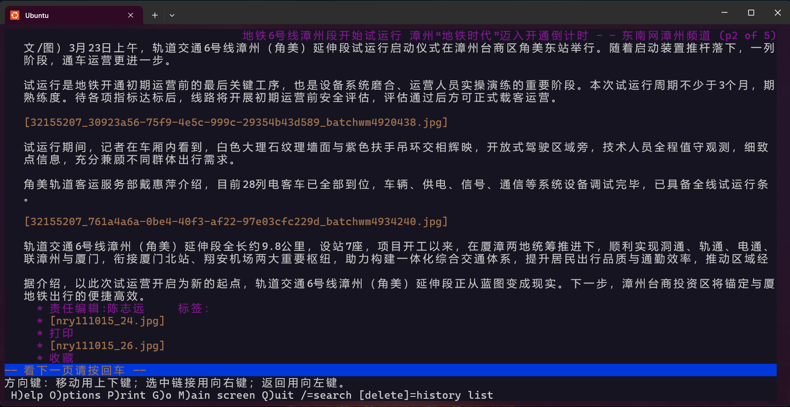

# WSL Ubuntu 上的常用软件

> 这些建议仅为个人喜好，仅供参考。  
> 部分软件在其他发行版中也可使用，也有部分软件在 [Arch Linux Wiki](https://wiki.archlinuxcn.org/wiki/%E9%A6%96%E9%A1%B5) 中有中文文档。  
>
> 开源社区真是太棒了！

不建议在 WSL 上安装完整的图形界面，仅应安装所需程序，[WSL 能打开](https://learn.microsoft.com/zh-cn/windows/wsl/tutorials/gui-apps)。  
如果你想尝试完整 Linux 系统，建议使用虚拟机（Hyper-V 上的 Linux 增强会话比较麻烦，不建议）或双系统或另一台电脑。

## 包管理器

各个发行版都有自己的包管理器，例如 Ubuntu 可以用 `apt`/`apt-get`、`snap` 等。  
如果你用过 [WinGet ~~鸡翅~~](https://learn.microsoft.com/zh-cn/windows/package-manager/winget/) 或 [Chocolatey ~~巧克力~~](https://chocolatey.org/) 或 [Scoop ~~勺子~~](https://scoop.sh/)，相信你对此不会感到陌生。

<details>
<summary>何译味</summary>

`winget` 被某个不知名的翻译软件翻译成了“翼尖”（wing + let，winglet），这本指飞机翼梢小翼，但某位文章作者联想到了“鸡翅”（🐔 wings）… 还是太饿了。  

`Chocolatey` 直译为“巧克力味”，这里简化为“巧克力”  

`Scoop` 是直译，就“勺子”的意思。  

另外，  
`apt` 也能“理解”成“安排它”（an pai ta）  
`snap` 也能“理解”成“收纳安排”（shou na an pai）或“说那<a href="https://www.bilibili.com/video/BV1ixiGBDEGq/?t=43" title="闽南语“爱拼才会赢”的意思，我漳州的读“ai bia jia ei ya~”">爱拼（甲欸鸭~）</a>”  

</details>

## Shell

[bash](https://www.gnu.org/software/bash/) 是最基本的，如果你觉得它“太单调了”可以试试 [fish shell](https://fishshell.com/) 或 [Nushell](https://www.nushell.sh/)。  
亦或者... [PowerShell](https://learn.microsoft.com/zh-cn/powershell/scripting/install/install-powershell-on-linux)？  

## 浏览器

在 Linux 上有很多浏览器可以选择，主要看个人喜好。  

### 图形界面

一些发行版会内置 [firefox](https://support.mozilla.org/zh-CN/kb/install-firefox-linux)，不过 WSL 没有，我喜欢用 [snap](https://snapcraft.io/firefox) 安装:
```shell
snap install firefox
```

或者，你也可以用 [Edge](https://www.microsoft.com/zh-cn/edge/download)（[_Holy cow, you got to be a psychopath._](https://www.bilibili.com/video/BV19Pw4zHEE8/?t=1154)）。

### 终端

> 这些浏览器不支持看图片和视频，别想用来刷视频。  
> 看些文本内容得了。  

可以试试 [Lynx](https://lynx.invisible-island.net/)（注意**不是**那个 js 框架）。

[](https://zzpd.fjsen.com/2026-03/23/content_32155207.htm)

## 编辑器

### 图形界面

最简单的 [Visual Studio Code](https://code.visualstudio.com/)，如果你在 Windows 上有安装它，你可以简单地直接运行 `code .` 或通过 [WSL 扩展](https://marketplace.visualstudio.com/items?itemName=ms-vscode-remote.remote-wsl) 连接到发行版进行编辑。  
你也可以通过 [snap](https://snapcraft.io/code) 在 Linux 上安装它，虽然没必要。  

### 终端

对我来说 [nano](https://www.nano-editor.org/) 可能比较适合新手，它可能已经装在发行版中了，直接运行 `nano "<你要编辑的文件>"` 就行。  
如果你想要代码高亮，可以看看 [scopatz/nanorc](https://github.com/scopatz/nanorc)。  

对于进阶者，[vim](https://www.vim.org/) 或 [Neovim](https://neovim.io/) 也是个选择。

对于那些追求“手不离键盘”的人，我想问个问题：“那为什么要发明鼠标呢？”  
