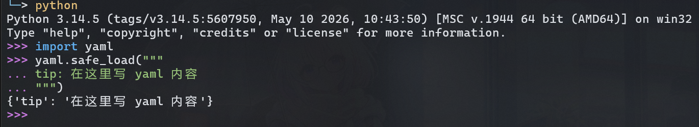

# YAML 中的多行文本

在 YAML 中，可以使用很多方式来表示多行文本。

## TL;DR

可以用 `|`、`|-`、`>`、`>-`或者直接写。

原样换行用 `|`，文件中换行但实际不换用 `>`。
不想要末尾换行加 `-`。
直接写等于 `>-`。

## `|`

`|` 会保留字符串中的换行符。

示例:
```yaml
text: |
  这是一段
  多行文本

```

表示:

> 注意这里末尾**有**换行。

```text
这是一段\n
多行文本\n

```

## `|-`

`|-` 和 `|` 差不多，但最后没有换行。

示例:
```yaml
text: |-
  这是一段
  多行文本

```

表示:

> 注意这里末尾**没**有换行。

```text
这是一段\n
多行文本
```

## `>`

使用 `>` 时，YAML 会折叠**换行符**，将它们**转换成空格**。  
需要注意的是这里换行符会换成空格，而不是不见。这可能比较适合英文单词间换行。  
如果内容比较长的话可以用这种方式，需要换行的时候直接空一行。

示例:
```yaml
text: >
  这是一段看似
  多行文本
  的单行文本
text_2: >
  如果需要换行的话
  请

  空一行
```

表示:

> 注意这里末尾**有**换行。

```text
这是一段看似 多行文本 的单行文本\n

```

```text
如果需要换行的话 请\n
空一行\n

```

## `>-` / 直接写多行

`>-` 和 `>` 差不多，但最后没有换行。

示例:
```yaml
text: 这是一段看似
  多行文本
  的单行文本
text_2:
  这是一段看似
  多行文本
  的单行文本
text_3: >-
  这是一段看似
  多行文本
  的单行文本
```

都表示:

> 注意这里末尾**没**有换行。

```text
这是一段看似 多行文本 的单行文本
```

---

## 验证一下

如果你不确定该用哪种，可以写完后读取看看是否符合自己预期。  
这里使用 Python 的 [PyYAML](https://pypi.org/project/PyYAML/) 解析，没安装的话先 `pip install pyyaml`。



不是在 REPL 中的可以加个 `print()`。

```python
import yaml

yaml.safe_load("""
tip: 在这里写 yaml 内容
""")
```
