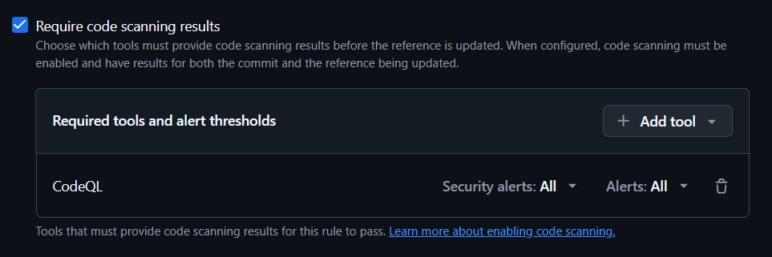
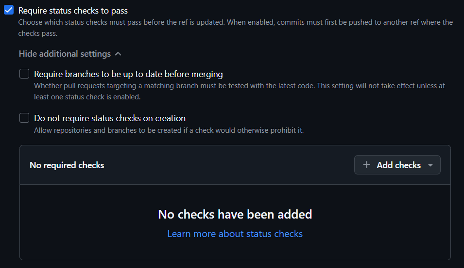
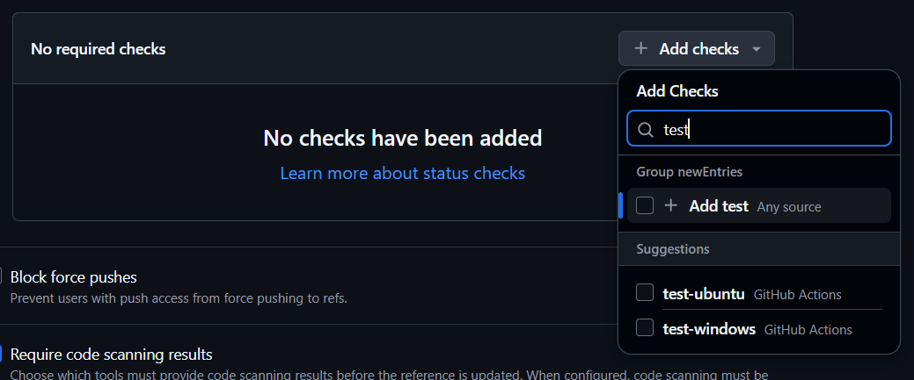

# 如何在分支保护规则集中要求 PR 必须通过自己的 CI/工作流

## CodeQL

勾选 `Require code scanning results`



## 自己写的工作流

勾选 `Require status checks to pass`



然后搜索自己工作流的 **job ID** 来添加，例如这里的 `test-windows` 和 `test-ubuntu`



> [!NOTE]  
> 这里搜的是 **job ID**。不是工作流文件名 (`test.yaml`)，也不是工作流名称 (`测试运行`)，也不是 job 名称 (`Windows上的测试`)。  
> 
> ```yaml
> name: 测试运行 # 不是这个
>  # .github/workflows/test.yaml # 不是这个
> 
> on:
>   # ...
> 
> permissions: {}
> 
> jobs:
>   test-windows: # <- 是这个
>     name: Windows上的测试 # 不是这个
>     # ...
> ```

添加进去后保存规则集就可以了。
