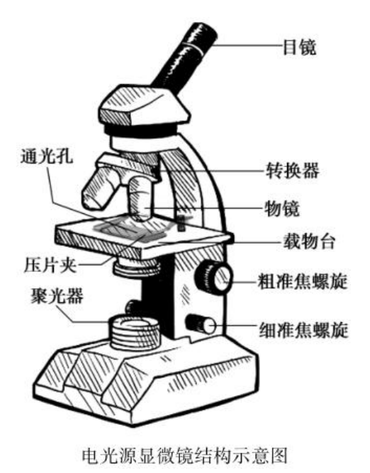
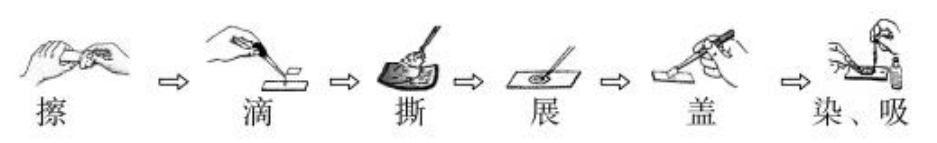
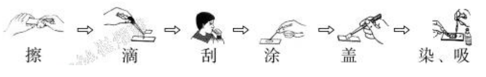
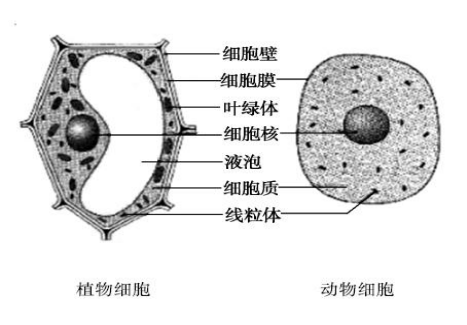
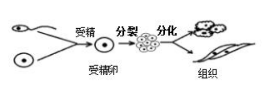

# 生物总复习(人教版)
## 前言
我会尝试尽量在这个Markdown文件中描述所有的重要知识点，会较多的以文字方式呈现。  
对于生物来讲，一般每一节对应一到两个知识点。  

## 标记说明
重要等级从⭐到⭐⭐⭐⭐⭐...⭐越多越重要。  
特别重要的点会用下面的形式表示:  

> [!NOTE]
> 这是特别重要的点。  

不一定要背的东西我会标`[选背]`。当然，以防万一你可以背下。  
必考的或可能性很高的会标`[必背]`。  
易错的标`[易错]`。  

## 第一章 认识生物
### 第一节 生物的特征 (⭐)
1. 生物的生活 **需要营养**
2. 生物能进行 **呼吸**
3. 生物能 **排出身体内产生的废物**
4. 生物能 **对外界刺激做出反应**
5. 生物能 **生长和繁殖**
6. 生物都有 **遗传和变异的特性**
7. (附加) **除病毒以外**，生物**都是由细胞构成的**

> 一般考题：送分选择题，问你哪个不算生物。  

### 第二节 调查周边环境中的生物 (⭐) [选背]
归类方法:  
- **形态特点**
  - 植物
  - 动物
  - 其他生物
- **生活环境**
  - 陆生生物
  - 水生生物
  - ...
- ...

## 第二章 了解生物圈
定义：地球上所有的生物**与其环境的总和**。 (⭐⭐)  

> [!NOTE]
> 切记包括环境

### 第一节 生物与环境的关系
#### 环境中的**生态因素**  
定义：*环境中* **影响生物的生活和分布**的因素。  
分类 (⭐⭐⭐):  
- **非生物因素**
  - 光、温度、水等
- **生物因素**
  - 影响某种生物生活的其他生物

#### 生物因素对生物的影响
生物间的关系：**捕食、竞争、合作、寄生、共生** 等。  
> 一般考题：问你xx与yy间是什么关系。  

#### 总结
**环境影响生物，生物适应环境，生物影响环境。**  

### 第二节 生物与环境组成生态系统
定义：在一定的空间范围内，生物**与环境**所形成的统一的整体。  

#### 生态系统的组成 (⭐⭐⭐⭐)
- 生物部分
  - 生产者：绿色植物 (光合作用制造有机物)
  - 消费者：各种动物 (促进生态系统物质循环)
  - 分解者：腐生的细菌、真菌
- 非生物部分
  - 阳光、空气、水等

<!--公式使用LaTeX-->
> [!NOTE]
> [必考] (⭐⭐⭐⭐⭐)  
> 提一嘴*第五章*的内容:  
> 
> $$
> 光合作用=CO_2 + 水 \underset{叶绿体}{\stackrel{光能}{\longrightarrow}} 有机物(储存着能量) + 氧气
> $$
> *仅有绿色植物才可光合作用。*  
> 
> $$
> 呼吸作用 = 有机物(储存着能量) + 氧气 \stackrel{线粒体}{\longrightarrow} CO_2 + 水 + 能量
> $$
>
> 关于分解者:  
> $$
> 有机物 \stackrel{分解者}{\longrightarrow} CO_2 + 水 + 无机盐
> $$

#### 食物链和食物网
食物链的组成：  
$$
生产者(起点) \longrightarrow 消费者 \longrightarrow 最高级消费者(终点)
$$

> [!NOTE]
> [易错]  
> 食物链中**不出现分解者和非生物部分**，箭头**指向捕食者**。  
> 能量最终来源是 **太阳能**。  
> 有毒物质随食物链不断累积 (最高级消费者体内积累最多)。
> 生态系统中的**物质和能量**沿着食物链和食物网流动。能量流动的特点是 **逐级递减，单向流动**。  
> 即：有毒递增，能量递减。  

#### 生态系统具有一定的自动调节能力
**生态平衡**定义：生态系统中各种生物的**数量**和**所占的比例**总是维持在**相对稳定**的状态。  
生态系统具有**一定的自动调节能力**，但这种自动调节能力是 **有一定限度** 的。  
> $$
> \uparrow 生物种类  \rightarrow  自动调节能力 \uparrow
> $$

### 第五节 生物圈是最大的生态系统 (⭐⭐⭐)
地球上最大的生态系统：生物圈  
范围：大气圈的底部、水圈的大部和岩石圈的表面  
特殊名称:  
- 森林生态系统：有 **“绿色水库”和“地球之肺”** 之称；自动调节能力**最强**。
- 湿地生态系统：有 **“地球之肾”** 之称，具有蓄洪抗旱，净化水质的作用。

## (2单元) 第一章 细胞是生命活动的基本单位
### 第一节 练习使用显微镜
[必考] (⭐⭐⭐⭐⭐)  
> 实验考试，20分。  
> 不过听说漳州直接给过，背结构就好了。  
> 双十的实验考试还带笔试...  

#### 结构 [必背]
  

#### 倍数 [选背]
$$
放大倍数 = 目镜倍数 \times 物镜倍数
$$

#### 显微镜使用过程中的常见问题
1. 下降镜筒：下降镜筒时眼睛要从**侧面看着物镜**，以免压破玻片标本或
损伤物镜镜头。[选背]
2. 玻片标本移动：移动玻片时，物像偏向哪个方向就将玻片向哪个方向
移动，即 **“偏哪移哪”**。
3. 污物位置判断：视野中的污点一般在目镜或玻片上，转动目镜，污点
移动说明污点在目镜上；污点不动则说明污点在玻片上。
4. **低倍镜换成高倍镜**的操作步骤：移动玻片，将物像移至视野中央→转
动**转换器**换用高倍物镜→调节光圈和反光镜调亮视野亮度→调节**细准焦螺旋**使物像更加清晰。
5. 显微镜下要观察的物体必须是**薄而透明**的。
6. 不要用手触摸镜头，如果镜头上有灰尘，只能用专用的**擦镜纸**来擦。[选背]

> 一般考题：实验题、选择题

#### 制作临时装片的操作步骤及注意事项
1. 制作洋葱表皮细胞临时装片步骤： 擦、滴（**清水**）、撕、展、盖、染
  
2. 制作人口腔上皮细胞临时装片步骤：擦、滴（**生理盐水**）、刮、涂、盖、染
  
注：使用生理盐水是为了**维持人口腔上皮细胞的正常形态**；  
**缓慢盖盖玻片是为了防止气泡的产生**；**用稀碘液染色的目的是使细胞核更明显，方便观察**。  

### 细胞是生命活动的基本结构和功能单位
**细胞**是生物体结构和功能的**基本单位**。除病毒外，生物都是由细胞构成的。病毒无细胞结构，但生命活动离不开活细胞。  

### 动植物细胞结构 (⭐⭐⭐⭐⭐) [必考]
  

| 结构名称 | 植物细胞 | 动物细胞 | 功能 |
|-----|-----|-----|-----|
| 细胞壁 | ✔ | × | 保护、支持 |
| **细胞膜** | ✔ | ✔ | 控制物质进出 |
| **细胞质** | ✔ | ✔ | 生命活动的主要场所 |
| **细胞核** | ✔ | ✔ | 内含遗传物质(DNA)，遗传信息库 |
| **线粒体** | ✔ | ✔ | 呼吸作用主要场所 |
| 叶绿体 | ✔(绿色部分) | × | 光合作用场所 |
| 液泡 | ✔ | × | 内有细胞液(含有味道的物质等) |

> [!NOTE]
> 区别：细胞壁、叶绿体、液泡  
> 都有：细胞核、质、膜，线粒体(加粗部分)  
> **叶绿体只存在于植物的绿色部分中**  
>
> | 细胞 | 能量转换器 |
> |-----|-----|
> | 动物细胞 | 线粒体 |
> | 植物细胞 | 线粒体、叶绿体 |

> [!NOTE]
> (⭐⭐⭐⭐⭐)  
> $$
> 细胞核 > 染色体 > DNA + 蛋白质 > 基因
> $$

### 细胞分裂、分化 (⭐⭐⭐)
- 从**受精卵**开始  
- **分裂**变多
- **分化**成不同组织

  

分裂: (**染色体**的变化最为明显)  
$$
单个细胞 \rightarrow 复制染色体 \rightarrow 一分为二
$$
$$
原细胞遗传物质 = 新细胞遗传物质
$$
分裂顺序:  
$$
核 \rightarrow 质 \rightarrow 膜 (\rightarrow 壁)
$$

> 一般考题：选择，选染色体数量  

... 余下内容日后补全，也可能不补全。  
希望参与编辑可以直接PR。  