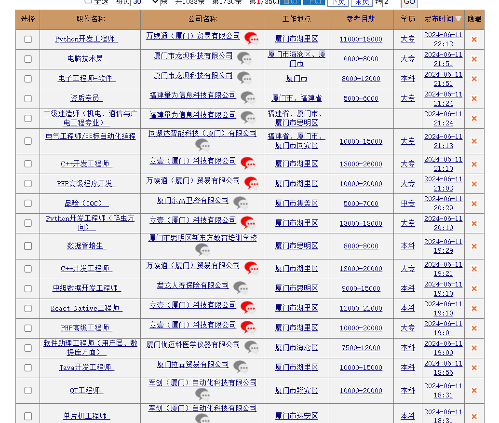
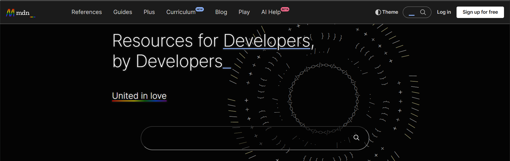

# 写代码月入十块不是梦！编程让你轻松实现财务自由！
在数字化浪潮的推动下，编写代码已经成为一种高收入的职业途径。不管你是初学者还是资深开发者，编程都能带来令人惊叹的收入。  

## 高薪编程职位等你来！
根据知名招聘网站的数据，软件工程师的平均年薪在全球范围内都非常诱人。在美国，初级软件工程师的起薪通常在**7万美元**左右，而经验丰富的开发者年薪更是轻松突破**15万美元**。在中国，一线城市的程序员年薪也在**20万**人民币以上，资深开发者的年薪甚至超过**50万**人民币！  

| 职位       | 平均年薪  |
|------------|-----------|
| 初级工程师 | $70,000   |
| 资深工程师 | $150,000  |
| 中国一线城市程序员 | ¥200,000  |
| 中国资深开发者     | ¥500,000  |

## 自由职业和远程工作，赚钱更轻松！
不想朝九晚五？编程还为你提供了自由职业和远程工作的无限可能。通过编程这个平台，许多程序员实现了**财务自由**。一些顶尖自由职业者的年收入甚至达到**六位数美元**！  

  
_信息来源：厦门人才网_  

## 创业致富，从写代码开始！
写代码不仅可以打工，还可以创业致富！许多成功的科技公司都是由程序员创立的，例如支付宝的马云、腾讯的马化腾。这些耳熟能详的名字背后，都有编程的身影。现代社会鼓励创新创业，程序员通过技术创新，不仅能够解决实际问题，还能建立自己的企业，获得巨额财富！  

  
_图片来源：[支付宝官网](https://www.alipay.com/index.html)_

## 编程教育，躺赚新方式！
随着编程需求的增加，编程教育也成为新的赚钱途径。许多资深程序员通过线上课程、培训营和出版书籍将他们的知识传授给其他人，既拓宽了收入来源，也帮助更多人进入这一高薪行业。  

  
_图片来源：Web开发不可或缺的资源：[MDN](https://developer.mozilla.org/zh-CN/)的官网_  

## 听听专家是怎么说的
**专家表示**：“编写代码是一项可以带来高收入的技能。不论是通过全职工作、自主创业、自由职业，还是教育培训，编程都为无数人提供了实现财务自由的机会。如果你还在犹豫是否要学习编程，现在就是最好的时机，掌握这项技能，你也可以赚取丰厚报酬，实现梦想。”  

**编写代码不仅仅是一种职业，更是一种开创未来、改变世界的力量！**  
